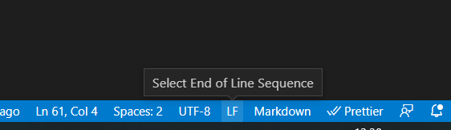
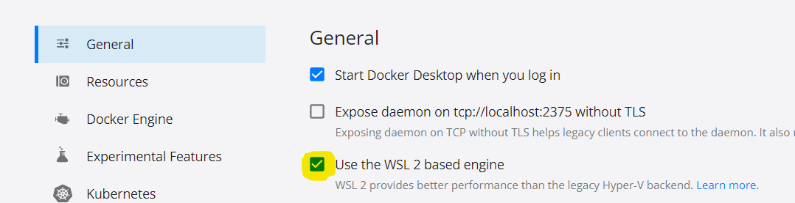
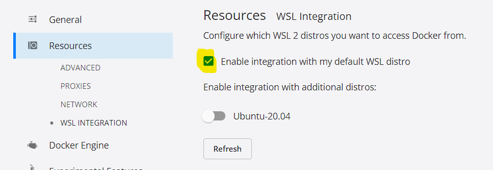

# Week 1 - WSL and Docker

> _We can skip the installation of WSL for now, since we will use GitPod for pretty much everything. Skip to the [Docker section](##Docker) instead_

#### Requirements

- Windows
- VS Code

## What is WSL?

You can run linux commands on windows!

https://docs.microsoft.com/en-us/windows/wsl/

### Install WSL 2

https://docs.microsoft.com/it-it/windows/wsl/install-win10

https://www.omgubuntu.co.uk/how-to-install-wsl2-on-windows-10

- check if it's already installed and, if not, install it

  ```
  wsl --help
  wsl --install
  ```

- install Ubuntu 20.04 LTS https://www.microsoft.com/store/productId/9N6SVWS3RX71
- set as default distro
  ```
  wsl --set-version Ubuntu-20.04 2
  ```
- open the wsl terminal
  ```
  wsl
  ```
- install Node.js (nvm): https://docs.microsoft.com/it-it/windows/dev-environment/javascript/nodejs-on-wsl (here there are also some recommended VS Code extension)

  ```
  sudo apt update && sudo apt upgrade
  sudo apt-get install curl

  curl -o- https://raw.githubusercontent.com/nvm-sh/nvm/v0.39.0/install.sh | bash

  export NVM_DIR="$HOME/.nvm"

  nvm install --lts

  sudo apt-get -y install git make
  ```

- create a directory inside wsl
  ```
  mkdir my-directory
  cd my-directory
  ```
- open VS Code

  ```
  code .
  ```

- ⚠ _Set LF instead CRLF!_
  

### Install Docker

- Download and install https://docs.docker.com/desktop/windows/install/
- Enable WSL integration
  
  

## Docker

Docker is an open platform for developing, shipping, and running applications. Docker enables you to separate your applications from your infrastructure so you can deliver software quickly. With Docker, you can manage your infrastructure in the same ways you manage your applications. By taking advantage of Docker’s methodologies for shipping, testing, and deploying code quickly, you can significantly reduce the delay between writing code and running it in production.

More about Docker: https://docs.docker.com/get-started/overview/

## Docker: reference

- https://docs.docker.com/reference/
- https://docs.docker.com/engine/reference/run/

Commands to start a docker container, show logs, stop, remove

```
docker pull nginx
docker run --name mi-caja -d nginx
docker logs -f mi-caja
docker stop mi-caja
docker rm mi-caja
```

- **Dockerfile**: text document that contains all the commands a user could call on the command line to assemble an image<br>
  Docs: https://docs.docker.com/engine/reference/builder/
- **Ports**: start and map http port

  `-p PORT_ON_MY_COMPUTER:DOCKER_CONTAINER_PORT`

  ```
  docker run -d -p 8080:80 --name mi-caja nginx
  ```

  (go to localhost:8080)

- **Volumes**: add custom html
  https://docs.docker.com/storage/volumes/

  `-v /my-computer-path:/docker-container-path`

  ```
  docker run -d -p 8080:80 --name mi-caja -v ~/repos/new-team-training/week-1/1-wsl-docker/nginx:/usr/share/nginx/html nginx
  ```

- Ways to create volumes:

  - **host volumes** (like the one of the example above `-v /my-computer-path:/docker-container-path`)
  - **anonymous volumes**: no path on my machine, docker takes care of creating it (`-v /docker-container-path`)
  - **named volumes**: something in between (`volume-name/docker-container-path`)

- Volume types (https://tkacz.pro/docker-volumes-cached-vs-delegated/)
  - **Read-only** (default)
  - **Cached** `/my-computer-path:/docker-container-path:cached`
  - **Delegated** `/my-computer-path:/docker-container-path:delegated`

## Docker compose

Compose is a tool for defining and running multiple docker containers at once. With Compose, we use a YAML file to configure our application's services. Then, with a single command, we create and start all the services we want. The services can also easily communicate to each other

> _We will use docker compose a lot for our development_

```
docker-compose pull
docker-compose up [container-name]
docker-compose down
```

Documentation: https://docs.docker.com/compose/

## Example

See the example in the `/1-wsl-docker/example` folder

https://blog.tinystacks.com/hello-world-express-app-with-docker
